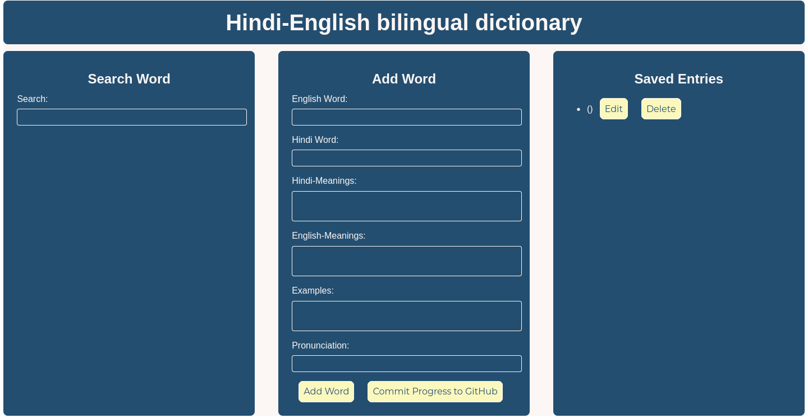

# Bilingual Dictionary Web Application

This is a simple bilingual dictionary web application that allows users to add, search, edit, and delete words in both Hindi and English. Users can also commit their progress to a GitHub repository.
Table of Contents

1. Features
2. Screenshots
3. Getting Started
4. Usage
5. Tech Stack
6. License
7. Contributing

## Features

Add new words with meanings, examples, and pronunciation in both Hindi and English.
Search for words within the locally stored dictionary.
Edit existing entries.
Delete entries.
Local storage for data persistence.
Option to commit progress to a GitHub repository (manual process).

## Screenshots

_Layout_

## Getting Started

To get a copy of the project up and running on your local machine, follow these steps:

### Clone the repository:

    git clone https://github.com/your-username/bilingual-dictionary.git

### Open the project directory:

    bash

    cd bilingual-dictionary

    Open index.html in your web browser.

## Usage

### Add Word:

Enter English and Hindi words.
Provide meanings, examples, and pronunciation.
Click "Add Word."

### Search Word:

Enter a search term in the search bar to find words.
Results display with meanings, examples, and pronunciation.

### Edit Entry:

Click "Edit" next to the word you want to modify.
Make changes in the input fields.
Click "Add Word" to save changes.

### Delete Entry:

Click "Delete" next to the word you want to delete.
Confirm deletion.

### Commit Progress to GitHub:

After making changes, click "Add Word."
Confirm if you want to commit progress to GitHub.
Open your Git client, add, commit, and push changes.

## Tech Stack

- HTML
- CSS
- JavaScript

## Contributing

Contributions are welcome! If you find a bug or have suggestions for improvement, please open an issue or submit a pull request.

## License

This project is licensed under the MIT License - see the [LICENSE](LICENSE) file for details.
